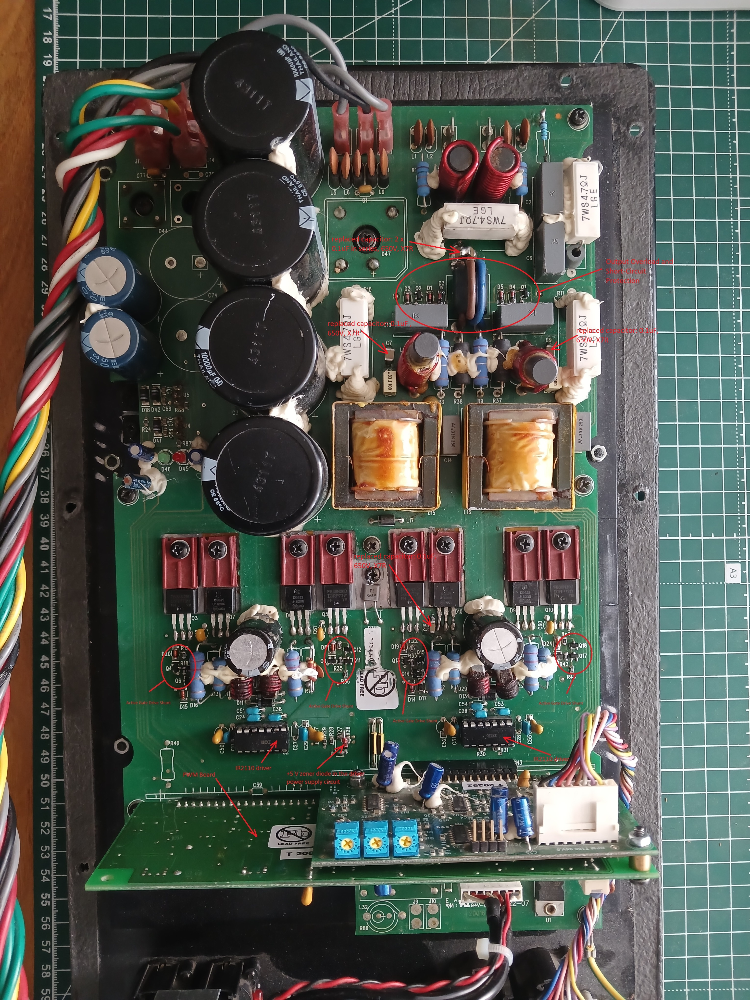

# FBT-PSR-118sA-Repair-Notes
Repair notes, reconstructed schematic fragments, component replacements, and troubleshooting documentation for the FBT PSR 118sA active subwoofer.

## Fault Description

Вихід з ладу вихідних MOSFET транзисторів типу IRFB38N20D. Усі несправні транзистори мали коротке замикання між виводами Drain, Source та Gate (D-S-G), внаслідок чого спрацьовував запобіжник по живленню.

Під час подальшої діагностики було виявлено такі несправності:

### Main Amplifier Board

* вихід з ладу вузла Active Gate Drive Shunt в одному із силових плечей;
* вихід з ладу двох драйверів IR2110;
* вихід з ладу стабілітрона +5 V у колі живлення драйверів;
* керамічний конденсатор біля одного із силових MOSFET мав відгорілий вивід.

### PWM Board

Стабілізатор 78L05 перебував у режимі обмеження струму. Подальша перевірка показала наявність короткого замикання по шині +5 V.

Після послідовного випаювання цифрових мікросхем серії 74HC було виявлено несправні компоненти:

* 74HC04D;
* 74HCU04D;
* 74HC00D.

## Active Gate Drive Shunt Reconstruction

Оригінальна схема вузла Active Gate Drive Shunt була відсутня.  
Схему вузла було реконструйовано за топологією друкованої плати, аналізом з'єднань та результатами вимірювань компонентів.  
Типи напівпровідникових елементів не вдалося достовірно визначити за маркуванням, тому для їх ідентифікації було використано тестер компонентів. Отримані результати були додатково перевірені на відповідність функціональному призначенню елементів у схемі.

Після визначення типів транзисторів було виконано підбір доступних аналогів з урахуванням:

- типу провідності;
- граничних напруг;
- допустимих струмів;
- параметрів керування;
- динамічних характеристик (зокрема вхідної ємності та заряду затвора);
- функціонального призначення у схемі.

[Фрагмент схеми Active Gate Drive Shunt](./schematics/Active_Gate_Drive_Shunt.PDF)

За результатами аналізу були застосовані:

* Q1 — IRLML9303;
* Q2, Q3 — BSS316NH;
* D1 — LL4148.

Зважаючи на відсутність достовірної інформації щодо оригінально встановлених компонентів та можливі відмінності динамічних характеристик напівпровідникових елементів, під час ремонту було виконано заміну компонентів вузла Active Gate Drive Shunt не лише в пошкодженому плечі, а в усіх чотирьох силових плечах підсилювача.  

| PCB Designator | Function | Installed Component |
|----------------|----------|---------------------|
| Q4, Q9, Q13, Q16 | P-Channel MOSFET | IRLML9303TRPBF |
| Q6, Q7, Q11, Q12, Q14, Q15, Q17, Q18 | N-Channel MOSFET | BSS316NH |
| D20, D8, D19, D24 | Fast Switching Diode | LL4148 |  

Таке рішення дозволило забезпечити максимально близькі характеристики вузлів керування силовими MOSFET та уникнути можливих відмінностей у режимах перемикання між окремими плечами.  
Після встановлення підібраних компонентів вузол працював штатно та не викликав зауважень під час подальшого налагодження і випробувань.  
Фото одного з плечей після ремонту:  
  

## Circuit Modifications

### DC Offset Adjustment

Після заміни операційних підсилювачів TL072 та TL074 у вузлі формування сигналу зворотного зв'язку з'явилося значне постійне зміщення на виході підсилювача.

Перевірка елементів вузла не виявила несправностей, однак штатна схема не передбачала можливості компенсації зміщення.

Для забезпечення регулювання DC offset було додано:

* підстроювальний резистор RV1 (100 kΩ), підключений між шинами живлення +16 V та -16 V;
* резистор R7 (1 MΩ), через який регульована напруга подається до сумуючого вузла каскаду на TL072.

Таке доопрацювання дозволило компенсувати постійне зміщення та відновити нормальний режим роботи підсилювача.

Додані компоненти:

* RV1 — 100 kΩ;
* R7 — 1 MΩ.

### Stability Compensation

Під час аналізу вузла було встановлено, що друкована плата передбачає встановлення конденсатора C1, однак у досліджуваному екземплярі компонент був відсутній.

Після заміни операційних підсилювачів TL072/TL074 схема втрачала стійкість: спостерігалося самозбудження, яке в окремих режимах призводило до насичення операційного підсилювача по одній із шин живлення.

Для відновлення стабільної роботи було встановлено конденсатор C1 відповідно до передбачених виробником посадкових місць на платі.  
Під час підбору номіналу встановлено:
- занадто малий номінал не забезпечує достатнього фазового запасу, що може призводити до самозбудження на окремих частотах;
- занадто великий номінал змінює параметри кола глибокого зворотного зв'язку, призводить до зростання коефіцієнта підсилення на низьких частотах та супроводжується збільшенням рівня шуму на виході підсилювача.  

Експериментально було встановлено, що конденсатор C1 номіналом 0,15 мкФ забезпечує стійку роботу вузла без ознак самозбудження при збереженні прийнятного рівня шуму.

  

[Фрагмент схеми із доданим DC Offset Adjustment](./schematics/DC_Offset_Adjustment.PDF)  
Примітки:
1. Схема є реконструкцією окремого вузла. Позиційні позначення компонентів введені для зручності опису та не збігаються з маркуванням компонентів на оригінальній платі.
2. RV1, R7 – додано під час ремонту для регулювання постійного зміщення.
3. C1 був відсутній на платі, яка ремонтувалась. Встановлений під час ремонту для забезпечення стійкості вузла.

## Repair of overload and short circuit protection unit
Під час налагодження та усунення самозбудження, коли лінія захисту від основної плати (pin 19) була тимчасово відключена, відбувся вихід з ладу вузла Overload and Short Circuit Protection.  
  
Схема забезпечує захист підсилювача від перевантаження та короткого замикання на виході. При перевищенні допустимого рівня або тривалості сигналу формується логічний сигнал аварії, який подається на входи SD (Shutdown) обох драйверів IR2110 та блокує роботу силового каскаду.  
Типи напівпровідникових елементів не вдалося достовірно визначити за маркуванням, тому для їх заміни було підібрано аналоги відповідно до функціонального призначення та режимів роботи.  

| PCB Designator | Function | Installed Component |
|----------------|----------|---------------------|
| Q1, Q2 | PNP Bipolar Transistor | MMBT6520L |
| R6, R7 | Resistor SMD, 470R | Resistor SMD 0805, 470R, 1% |
| D1 - D5 | Fast Switching Diode | LL4148 |  

## Main Board After Repair

## PWM Board Connector Pinout

To facilitate troubleshooting and testing, a custom adapter cable was built to access the PWM board outside the amplifier assembly.

Since no service documentation was available, the connector pinout was reconstructed by PCB trace inspection, component analysis, and signal measurements.

| Pin | Signal / Function | Notes |
|-----|-------------------|--------|
| 1   | AIN + | Analog Input Positive |
| 2   | AIN-  | Analog Input Negative |
| 3   | AGND  | Analog Ground |
| 4   | +17V | Positive analog supply voltage (+17V) |
| 5   | -17V | Negative analog supply voltage (-17V) |
| 6   | ?    | to analog board, pin 8 |
| 7   | -    | Not used |
| 8   | SNS+ / Analog Input, DC-Coupled | Positive post-filter remote sense input to the differential feedback amplifier. Establishes system AC gain and maintains output DC offset at zero. |
| 9   | SNS- / Analog Input, DC-Coupled | Negative post-filter remote sense input to the differential feedback amplifier. Establishes system AC gain and maintains output DC offset at zero. |
| 10  | Hin A | High-side logic input for Bridge Arm A (to U2 (IR2110), pin 10) |
| 11  | Hin B | High-side logic input for Bridge Arm B (to U3 (IR2110), pin 10) |
| 12  | Lin A | Low-side logic input for Bridge Arm A (to U2 (IR2110), pin 12) |
| 13  | Lin B | Low-side logic input for Bridge Arm B (to U3 (IR2110), pin 12) |
| 14  | FAULT_IN | Overload and short circuit protection input. Raw error signal from main board to Schmitt trigger. |
| 15  | Gnd | Main ground. Connected to IR2110 pin 2 (COM) and logic circuitry |
| 16  | Gnd | - // - |
| 17  | AC_DET (?) | AC-power-OFF mute (maybe). Goes to C1237 pin 4 |
| 18  | OTP_IN | Over-temperature protection input from 120°C PTC thermistor F1 (6N) to C1237 pin 1 |
| 19  | SD_OUT | Logic shutdown output to SD pin 11 of both IR2110 drivers |
| 20  | +14.2V | Main logic supply voltage (input to L7805 regulator for +5V rail). |  

## Disclaimer

The schematic fragments published in this repository were reconstructed from PCB inspection and measurements and are provided for educational and repair documentation purposes. They are not official manufacturer documentation.  

## License

This work is licensed under CC BY 4.0.

See the LICENSE file for details.
